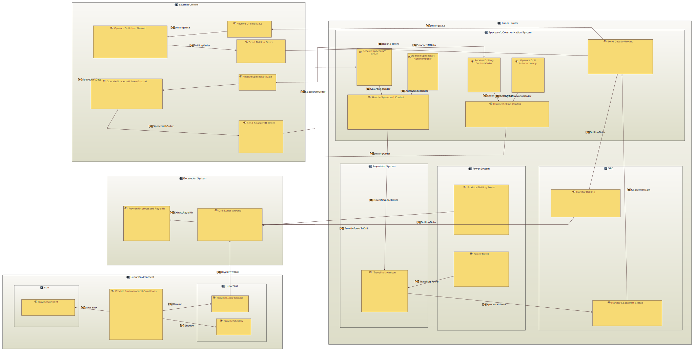
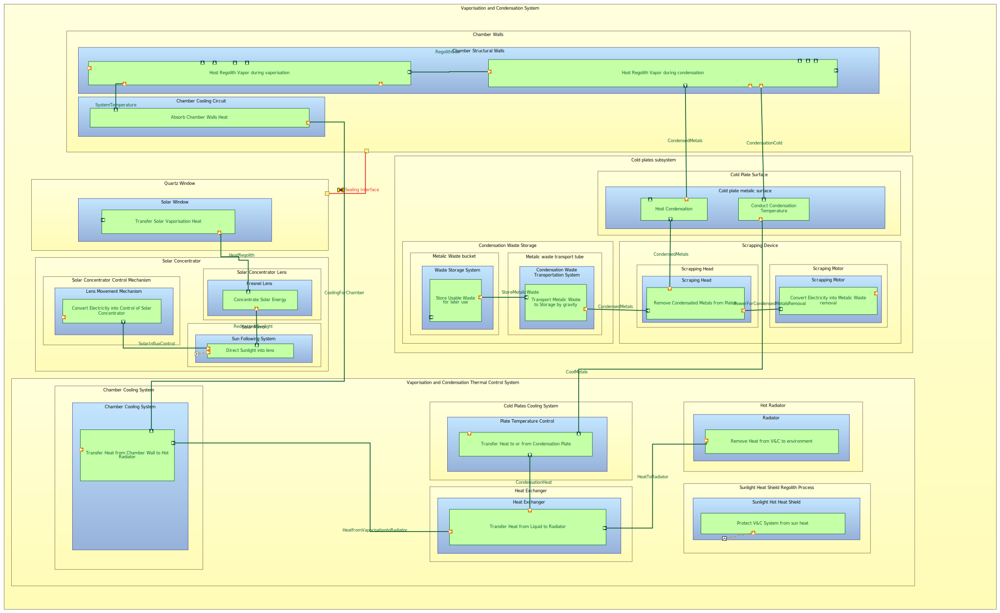
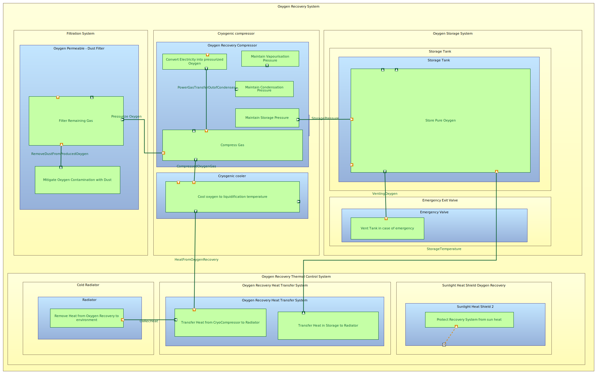
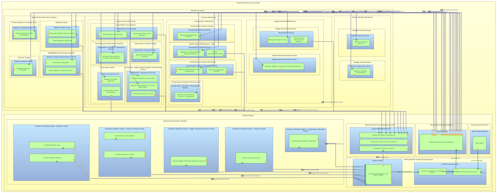
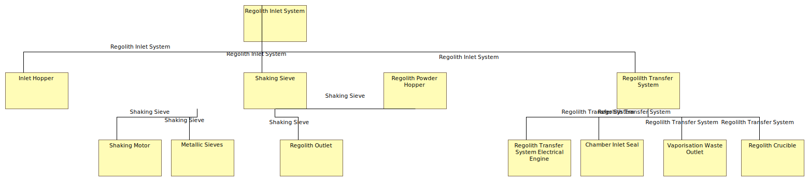
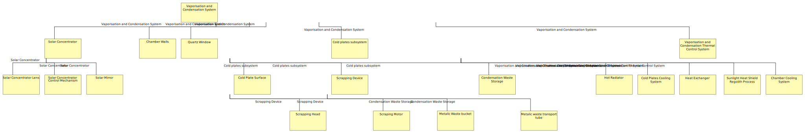
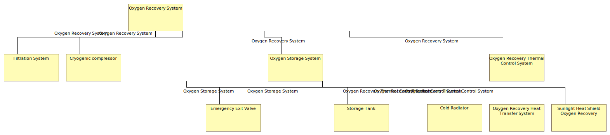
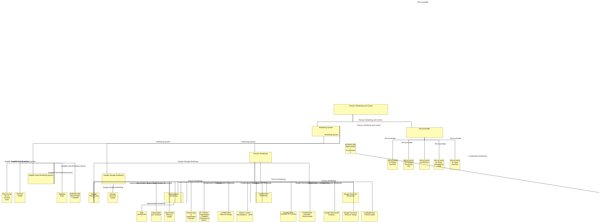
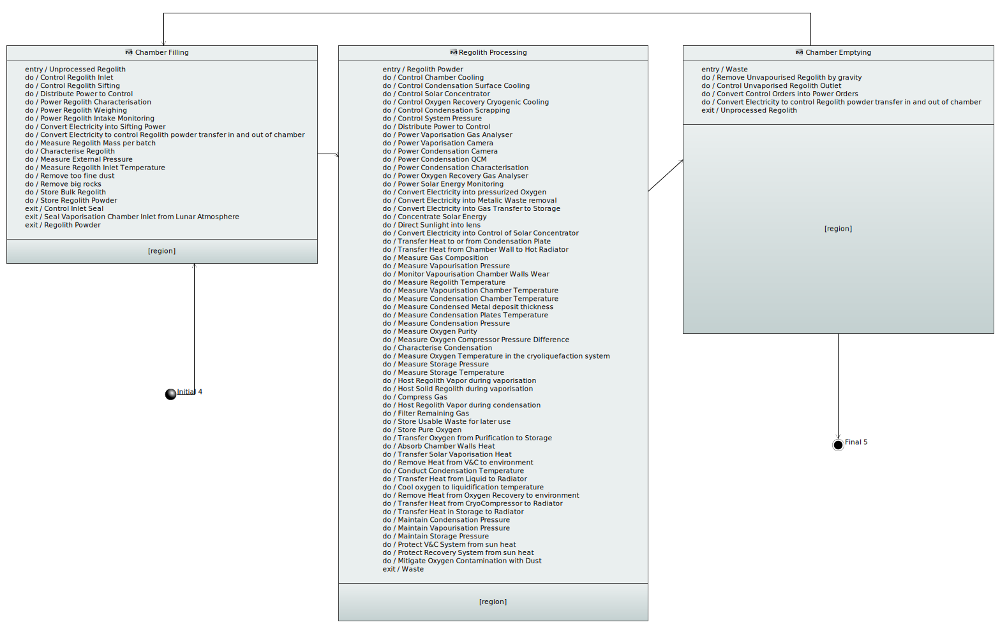

# ROxE - Dum Spiro, Spero
Regolith Oxygen Extractor Model by Kim Lamboley

## Capella Model

### Files

 * RegolithO2ExtractionDemonstrator : Capella Model for an Oxygen Extractor from Lunar Regolith
 * Model-SVG : File regrouping all the .svg documents that are displayed in this README file

## Capella add-ons used

* Requirements Viewpoint
* BasicMass
* Property Values Management Tool (not used yet)
* Diagram Styler
* Python4Capella

## Model Diagrams

### Operational Analysis
#### Operational Context

### Functional Analysis
#### High-level functions

#### Low-level functions

#### Root Physical Functional Breakdown

### Logical Architecture
#### Whole System - Logical Architecture Blank

#### Whole System - Logical Component Breakdown

### Physical Architecture
#### Physical Architecture - Vaporisation and Condensation System

#### Physical Architecture - Regolith Intake System

#### Physical Architecture - Oxygen Recovery and Storage System

#### Physical Architecture - Process Control and Monitoring

#### Physical Component Breakdown - RIS

#### Physical Component Breakdown - VCS

#### Physical Component Breakdown - ORSS

#### Physical Component Breakdown - PMC

### Process Description

