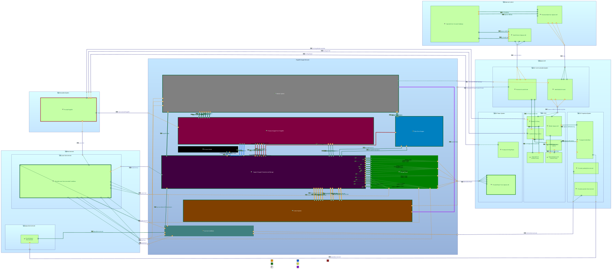

# ROxE - Dum Spiro, Spero
Regolith Oxygen Extractor Model by Kim Lamboley

## Capella Model

### Files

 * RegolithO2ExtractionDemonstrator : Capella Model for an Oxygen Extractor from Lunar Regolith
 * Model-SVG : File regrouping all the .svg documents that are displayed in this README file

## Capella add-ons

* Requirements Viewpoint add-on

## Model Diagrams

### Operational Analysis
#### Operational Context

### Functional Analysis
#### High-level functions

#### Low-level functions

### Logical Architecture
#### Whole System - Logical Architecture Blank

### Physical Architecture
#### Physical Architecture Blank
